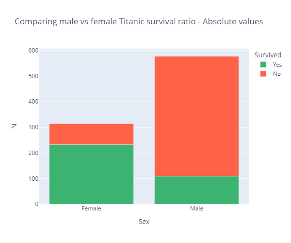

# Técnicas de Visualización
En este enlace muestro las visualizaciones trabajadas para la PEC2 de la asignatura Visualización de Datos.

## Bar Chart
El primer tipo de visualización es **bar chart**. A continuación muestro dos ejemplos usando el *Titanic dataset*.

